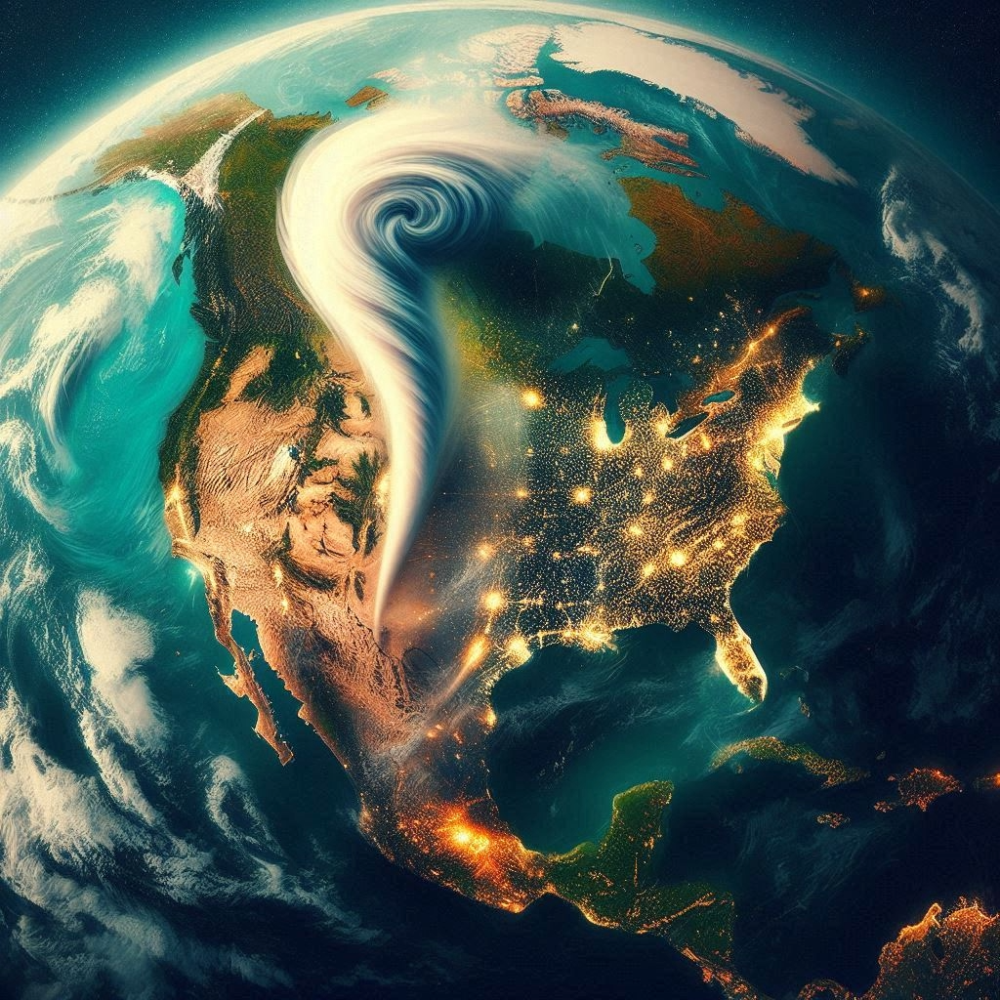

# Tornados en Estados Unidos (1950–2022)

<p align="center">
  <
</p>

Desde 1950 hasta 2022, Estados Unidos ha sido escenario de miles de tornados, convirtiéndose en uno de los países más afectados por este tipo de fenómenos meteorológicos extremos. A lo largo de estas más de siete décadas, los tornados han causado estragos tanto en vidas humanas como en la infraestructura económica, dejando una profunda huella en comunidades vulnerables, especialmente en regiones como el llamado "Tornado Alley".

Uno de los aspectos más alarmantes de estos eventos es el impacto económico. De acuerdo con los registros históricos, las pérdidas económicas asociadas a los tornados se cuentan en millones de dólares, con años particularmente devastadores como 2011 y 1974, donde los daños fueron catastróficos tanto por la cantidad de tornados como por su intensidad.

La intensidad de los tornados suele medirse mediante la escala Fujita (F0 a F5), que clasifica los tornados en función de la velocidad del viento y la severidad del daño. En este período, se han documentado tornados de magnitudes extremas (como F4 y F5), capaces de arrasar ciudades enteras, derribar estructuras reforzadas y generar pérdidas humanas y económicas de gran magnitud.

Este contexto justifica la necesidad de aplicar herramientas modernas, como los algoritmos de Machine Learning, para anticipar el impacto de futuros tornados, evaluar su intensidad potencial y estimar los posibles daños económicos, contribuyendo a una mejor gestión del riesgo y preparación ante desastres.


Check out the content pages bundled with this sample book to see more.

```{tableofcontents}
```
